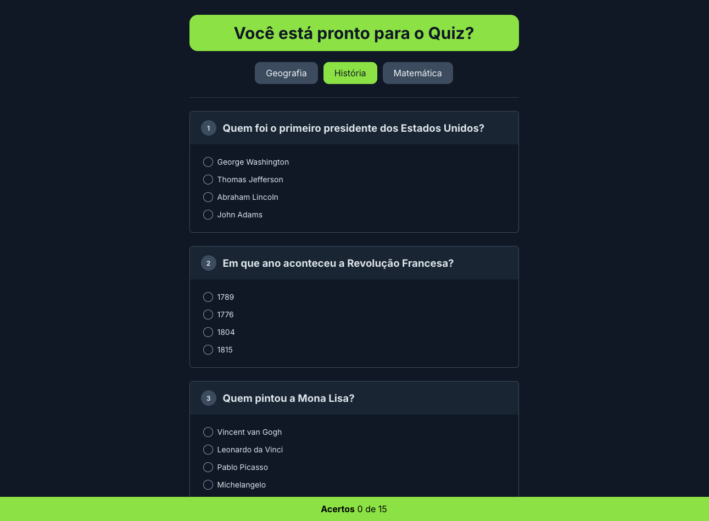

# Quiz dinâmico

Quiz dinâmico com alteração das perguntas conforme o tema relacionado.

Aplicação desenvolvida utilizando HTML, CSS e TS.

  <a href="#-Executar">Executar</a>&nbsp;&nbsp;&nbsp;|&nbsp;&nbsp;&nbsp;
  <a href="#-tecnologias">Tecnologias</a>&nbsp;&nbsp;&nbsp;|&nbsp;&nbsp;&nbsp;
  <a href="#-projeto">Projeto</a>&nbsp;&nbsp;&nbsp;|&nbsp;&nbsp;&nbsp;
  <a href="#-licença">Licença</a>

  

 

  

## ⏳ Executar

Para executar o projeto realize os passos a seguir:
- Clonar o repositório Git em seu ambiente local
- Realizar a instalação das dependências do projeto `npm i`
- Use o comando TypeScript para transpilar o arquivo .ts para .js `tsc quiz.ts`
- O arquivo .js gerado já foi adicionado no HTML para facilitar ``
- Agora basta abrir o arquivo `index.html` para visualizar o projeto 

## 🚀 Tecnologias

Esse projeto foi desenvolvido com as seguintes tecnologias:

- HTML
- CSS
- TypeScript

## 💻 Projeto

Nesse projeto desenvolvi um quiz onde as perguntas são modificadas conforme o tema selecionado, tornando o jogo dinâmico e mais interativo.

## 📝 Licença

Esse projeto está sob a licença MIT.